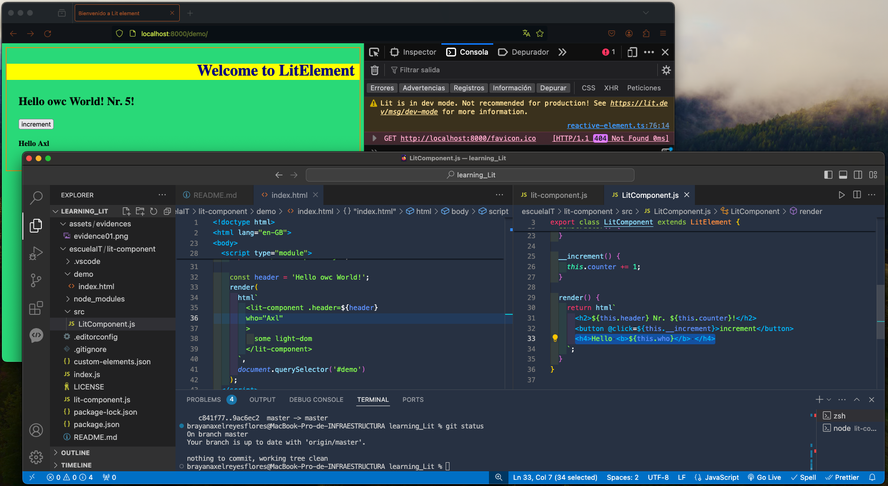

# Learning litElement 🤠
First 8 commits are from lit tutorial
do it by yourself in:
[Lit tutorial](https://lit.dev/tutorials/intro-to-lit/)

# Starting
1. [Web Dev Server](./escuelaIT/lit-component/README.md)
2. [Open Web Components](./curso-lit/readme.md)

## 1) [Web Dev Server](https://modern-web.dev/docs/dev-server/overview/) 🌿

### ➡️
## starting a project

```
npm init -y
```

### Install Web Dev Server


#### Environment
install a web environment


```
npm i --save-dev @web/dev-server
```

add to scripts

```
"start": "web-dev-server --node-resolve --open --watch"
```

### Install Lit

```
npm install lit
```

# Let's Go
```
npm run start
```

## 2) [Web Open Components](https://open-wc.org/) 🌿
### ➡️ 
Quick Start
```
npm init @open-wc
```

#  Excersices:


✅
- hello world 
- counter


🤓 [Learning Notes](./escuelaIT/general_notes.txt) 👀


### NEXT STEPS
  - Create another branch and separate courses
  - 